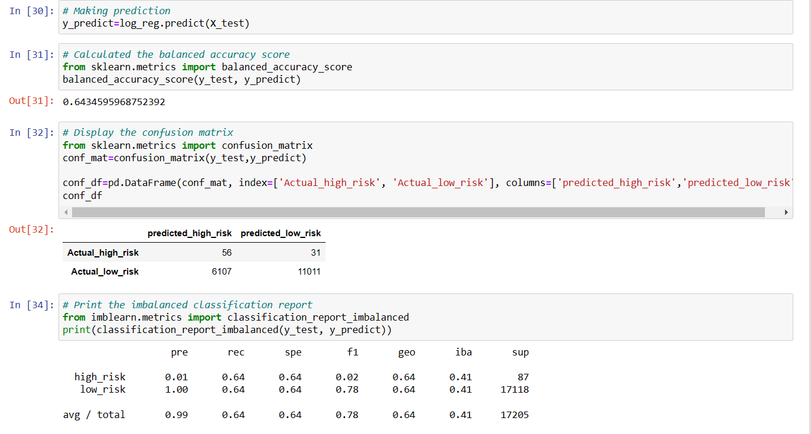
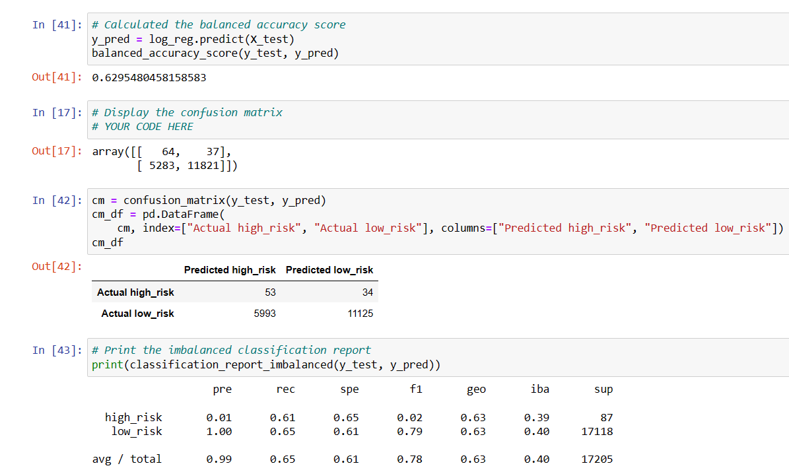
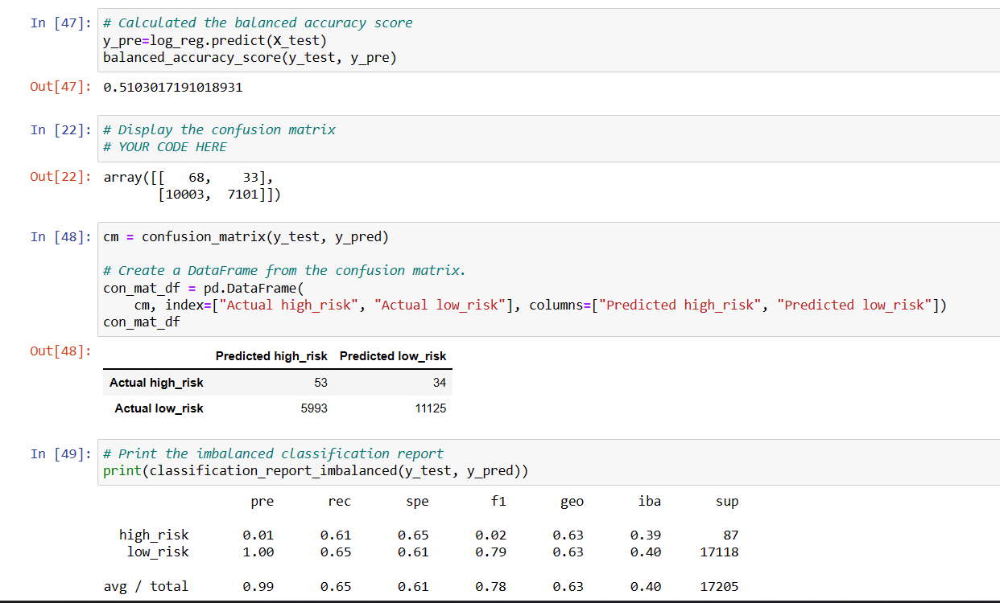
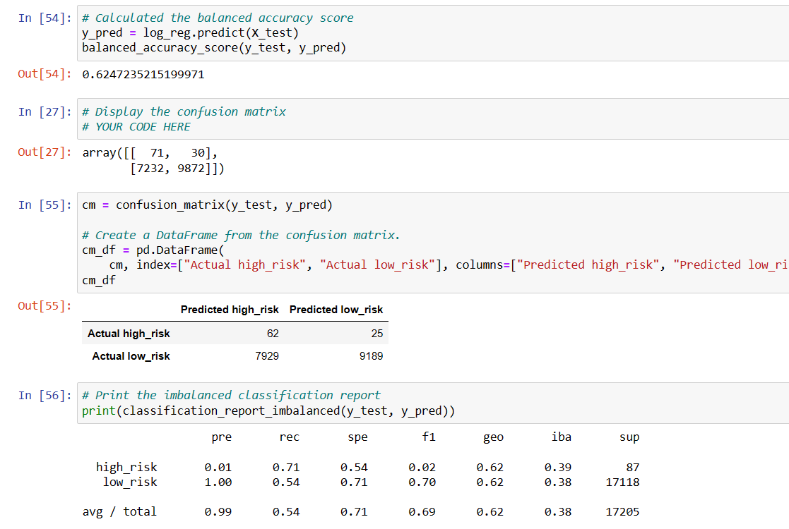
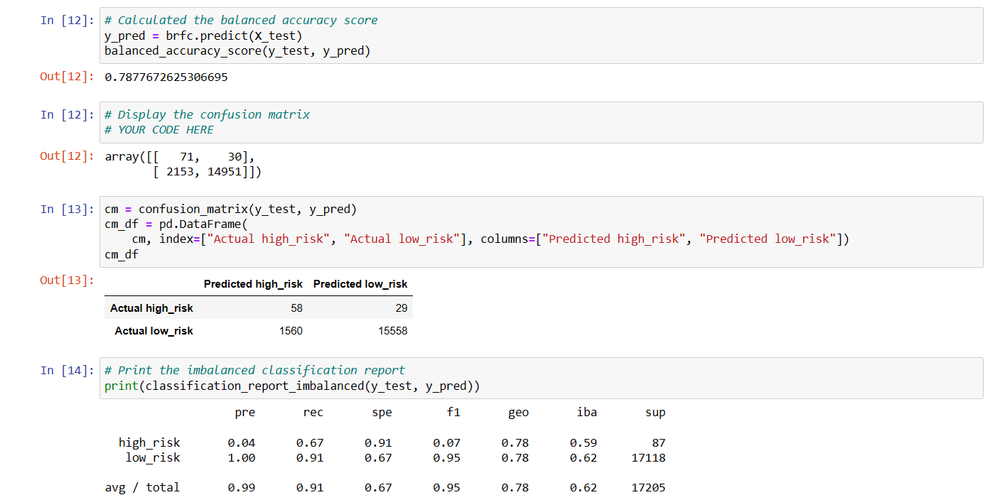
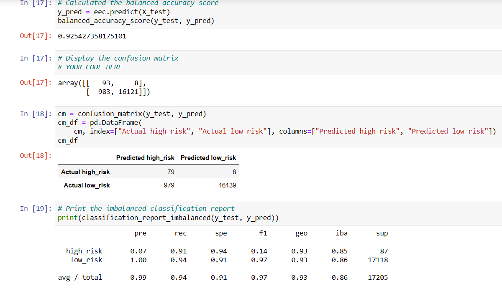

# Credit_Risk_Analysis

The purpose of this analysis is to analyze unbalanced classification problem of Credit Risk where in good loans outnumber risky loans.

- imbalanced-learn and scikit-learn libraries are use to build and evaluate models using resampling
- Using the credit card credit dataset from LendingClub, a peer-to-peer lending services company, oversampling of is performed using *RandomOverSampler* and *SMOTE* algorithms, and undersample the data using the ClusterCentroids algorithm.
- Then a combinational approach of over and undersampling using the *SMOTTEN* alogorithm is performed.
- The next step is to compare two new machine learning models that reduce bias, *BalancedRandomForestClassifier* and *EasyEnsembleClassifier* to predict credit risk.

## Using Resampling model to predict Risk

- The Logistic Regression model is obtained on training and testing dataset. The logisitic regression model is trained using resampled data which is the resultant dataset of Random OverSampling. 
- Confusion Matrix, Balanced accuracy Score and imbalanced classfication report are derived as below.

From the above figure below are the inferences drawn

- The balanced accuracy score is 65%
- The high_risk precision is about 1% only with 62% sensitivity which makes a F1 of 2% only.
- Due to the high number of the low_risk population, its precision is almost 100% with a sensitivity of 68%.

## Using SMOTE algorithm 

- The logisitic regression model is trained using resampled data which is the resultant dataset of SMOTE OverSampling.
- Confusion Matrix, Balanced accuracy Score and imbalanced classfication report are derived as below.

From the above figure below are the inferences drawn

- The balanced accuracy score is 64%.
- The high_risk precision is about 1% only with 63% sensitivity which makes a F1 of 2% only.
- Due to the high number of the low_risk population, its precision is almost 100% with a sensitivity of 66%.

## Under Sampling the data using ClusterCentroids alogorithm

- The logisitic regression model is trained using resampled data which is the resultant dataset of ClusterCentroids algorithm
- Confusion Matrix, Balanced accuracy Score and imbalanced classfication report are derived as below.

From the above figure below are the inferences drawn

- The balanced accuracy score is down to about 52%.
- The high_risk precision is still 1% only with 63% sensitivity which makes a F1 of 1%.
- Due to the high number of false positives, the low_risk sensitivity is only 40%.

## Using Combination approach of SMOTTEN algorithm

- The logisitic regression model is trained using resampled data which is the resultant dataset of ClusterCentroids algorithm
- Confusion Matrix, Balanced accuracy Score and imbalanced classfication report are derived as below.

From the above figure below are the inferences drawn

- The balanced accuracy score is about 62%.
- The high_risk precision is still 1% only with 68% sensitivity which makes a F1 of only 2%.
- Due to the high number of false positives, the low_risk sensitivity is 57%.

The balanced accuracy score is between 60 to 65% from above models except the ClusterCentriod model when the data is undersampled. There is not much difference in the above predictions drawn

## Modelling using Balanced Random Forest Classifier

- The logisitic regression model is trained using resampled data which is the resultant dataset of Balanced Random Forest Classifer algorithm
- Confusion Matrix, Balanced accuracy Score and imbalanced classfication report are derived as below.

From the above figure followng inferences are drawn

- The balanced accuracy score improved to about 79%.
- The high_risk precision is still low at 4% only with 67% sensitivity which makes a F1 of only 7%.
- Due to a lower number of false positives, the low_risk sensitivity is now 91% with 100% presicion.

## Modelling using Ensemble Classifier

- The logisitic regression model is trained using resampled data which is the resultant dataset of Balanced Random Forest Classifer algorithm
- Confusion Matrix, Balanced accuracy Score and imbalanced classfication report are derived as below.

From the above figure following inferences are drawn

- The balanced accuracy score is now increased to about 93%.
- The high_risk precision is still low at 7% only with 91% sensitivity which makes a F1 of only 14%.
- Due to a lower number of false positives, the low_risk sensitivity is now 94% with 100% presicion.

## Summary 

- The Random Sampling algorithms (Both Over and undersampling) predict weak precision in determining if credit risk is high
- However ensemble model seems to be more promising by incresing the accuracy score and improvment specially on the sensitivity of the high risk credits.
- The EasyEnsembleClassifier model shows a recall of 92% so it detects almost all high risk credit
- However, this model still doesn't effectively predict low_risk credit
- Low risk credits are still falsely detected as high risk which would penalize the bank's credit strategy which would impact the business opportunities.
